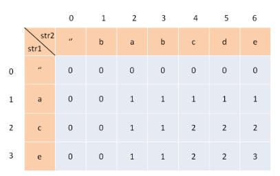
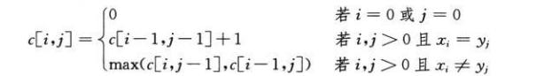

## 描述
给定两个字符串 text1 和 text2，返回这两个字符串的最长公共子序列。

一个字符串的 子序列 是指这样一个新的字符串：它是由原字符串在不改变字符的相对顺序的情况下删除某些字符（也可以不删除任何字符）后组成的新字符串。
例如，"ace" 是 "abcde" 的子序列，但 "aec" 不是 "abcde" 的子序列。两个字符串的「公共子序列」是这两个字符串所共同拥有的子序列。

若这两个字符串没有公共子序列，则返回 0。

## 示例

输入：text1 = "abcde", text2 = "ace" 
输出：3  
解释：最长公共子序列是 "ace"，它的长度为 3。

## 思路
这是一个二维DP问题，首先可以这么理解：
如果一个字符在LCS中，那么它一定在两个字符串中都出现，用i，j两个指针从后往前遍历s1，s2，如果s[i] == s[j]，那么这个字符一定在lcs中，
否则这两个字符至少有一个不在lcs中，需要丢弃一个，所以可以写出递归实现。

```
// 伪代码
longestCommonSubsequence(s1, s2) 
	return dp[s1.length-1][s2.length-1]

dp(i, j)
	if i = -1 or j = -1
		return 0
	if s1[i] == s2[j]
		return dp[i-1][j-1] + 1
	else
		return max(dp[i-1][j], dp[i][j-1])
```
### 定义dp table
使用DP table，定义一个数组dp[i][j]，其中，dp[i][j] 的含义是：对于 s1[1..i] 和 s2[1..j]，它们的 LCS 长度是 dp[i][j]

此表dp[0][j]表示s1为空串的情况，最大公共序列是''，长度是0，与此类推，dp[i][0]也是0

### 找出状态转移方程
状态转移方程如下：


### 找出序列
如果要找出序列，可以再定义一个数组来保存，也就是当s[i] == s[j]的时候，保存该字符

### 复杂度分析
时间复杂度Θ(mn)，空间复杂度Θ(mn)
## 实现

```javascript
/**
 * @param {string} text1
 * @param {string} text2
 * @return {number}
 */
var longestCommonSubsequence = function(text1, text2) {
    if (!text1 || !text1)
        return '';
    let dp = [];
    // dp[0][j]和dp[i][0]都是0，表示两者中又一个为空串，最大子串长度为空
     for (let i = 0; i <= text1.length; i++) {
         dp.push([0]);
     }
        
    for (let i = 0; i <= text2.length; i++)
        dp[0][i] = 0;

    for (let i = 1; i <= text1.length; i++) {
        for (let j = 1; j <= text2.length; j++) {
            if (text1[i - 1] == text2[j - 1])
                dp[i][j] = dp[i-1][j-1] + 1;
            else
                dp[i][j] = Math.max( dp[i-1][j], dp[i][j-1]);
        }
    }
    return dp[text1.length][text2.length];
};
```