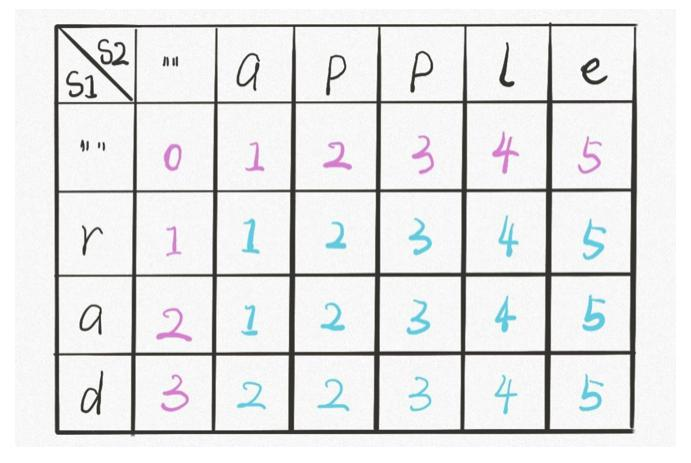
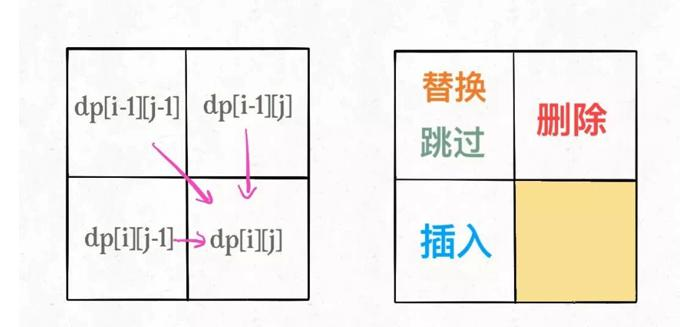

## 描述
给定两个单词 word1 和 word2，计算出将 word1 转换成 word2 所使用的最少操作数 。

🐧厂题

你可以对一个单词进行如下三种操作：

插入一个字符
删除一个字符
替换一个字符

## 示例
输入: word1 = "horse", word2 = "ros"
输出: 3
解释: 
horse -> rorse (将 'h' 替换为 'r')
rorse -> rose (删除 'r')
rose -> ros (删除 'e')

## 思路
本题是字符串题，所以可以尝试用i，j指针从右往左遍历字符串，假定本题是由s1转换为s2。

本题实际上有四个操作，还有一个跳过操作，当两个字符相等，选择跳过才可以使编辑距离最小。

替换操作与跳过操作：i，j同时往前移动，编辑距离加1
删除操作：i往前，j不动，编辑距离加1
插入操作：i不动，j往前，编辑距离加1


### 定义dp table
dp[i][j]表示s[i]->s[j]的最小编辑距离，大小为m*n




### base case
dp[0][j] 表示s1为空串，s2不为空，最小距离是插入操作s2的长度次数，同理dp[i, 0]也是如此

要求解的结果是
dp[s1.length][s2.length]
### 状态转移方程
```
dp[i][j] = {
	s[i] == s[j]: dp[i-1][j-1], 
	s[i] !== s[j]: min(dp[i-1][j], dp[i][j-1], dp[i-1][j-1]) + 1
}
```
## 实现
```
/**
 * @param {string} word1
 * @param {string} word2
 * @return {number}
 */
var minDistance = function(word1, word2) {
    let dp = new Array(word1.length+1)
        // let dp = [...new Array(n)].map(() => new Array(m));
    
        for (let i = 0; i <= word1.length; i++) {
            dp[i] = [];
            dp[i][0] = i;
        }
            
        for (let j = 0; j <= word2.length; j++) 
            dp[0][j] = j;
    
        for (let i = 1; i <= word1.length; i++) {
            for (let j = 1; j <= word2.length; j++) {
                if (word1[i - 1] == word2[j - 1])
                    dp[i][j] = dp[i - 1][j - 1]; // 跳过
                else
                    dp[i][j] = Math.min(dp[i][j - 1], dp[i - 1][j], dp[i - 1][j - 1]) + 1;
            }
        }
    
    return dp[word1.length][word2.length];
};
```

## 扩展
如果要保存序列，还要用一个数组来保存
