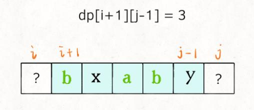
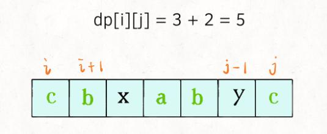
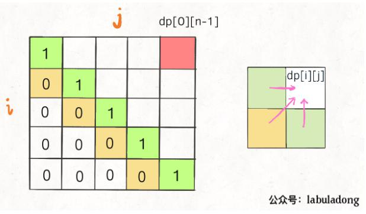
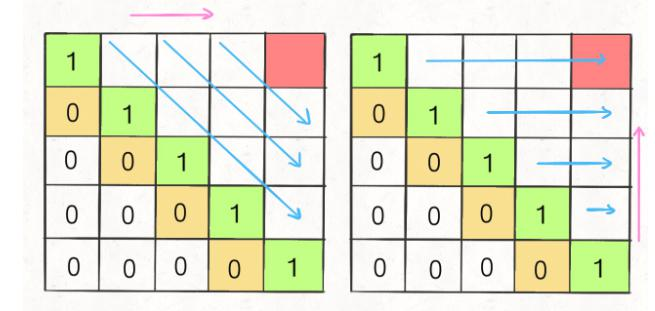

## 描述
给定一个字符串s，找到其中最长的回文子序列。可以假设s的最大长度为1000。

## 示例
输入:"bbbab"
输出: 4

## 思路
子序列是可以不连续的，这个题用dp解决

### 定义dp table
dp 数组的定义是：在子串 s[i..j] 中，最长回文子序列的长度为 dp[i][j]

### 状态转移方程
求 dp[i][j]，由 dp[i+1][j-1] 的结果（s[i+1..j-1] 中最长回文子序列的长度可以求得

如果s[i] === s[j], dp[i][j] = dp[i+1][j-1]+2，相当于dp[i+1][j-1]的最长子序列的长度加上i，j的长度

如果s[i] !== s[j]，dp[i][j] = max(dp[i+1][j], dp[i][j-1])，说明它俩不可能同时出现在 s[i..j] 的最长回文子序列中，那么把它俩分别加入 s[i+1..j-1] 中，看看哪个子串产生的回文子序列更长即可

### base case
dp[i][j] = 1, i == j，如果只有一个字符，最大长度是1
i 应该小于j，所以i>j应该为0

为了保证每次计算 dp[i][j]，左下右方向的位置已经被计算出来，只能斜着遍历或者反着遍历：


## 实现
```javascript
/**
 * @param {string} s
 * @return {number}
 */
var longestPalindromeSubseq = function(s) {
    let dp = new Array(s.length);

    for (let i = 0; i < s.length; i++) {
        dp[i] = new Array(s.length).fill(0);
    }

    for (let i = s.length - 1; i >= 0; i--) {
        dp[i][i] = 1;
        for (let j = i + 1; j < s.length; j++) {
            if (s[i] === s[j])
                dp[i][j] = dp[i + 1][j - 1] + 2;
            else
                dp[i][j] = Math.max(dp[i + 1][j], dp[i][j - 1]);     
        }
    }
    
    return dp[0][s.length - 1];
};
```

## 优化
因为只用到了左、下、左下三个变量，可以用一维数组来保存左和下，用一个变量保存左下
也就是改为:
dp[i][j] = tmp + 2;
dp[i][j] = max(dp[j], dp[j-1])

### 代码
```
let dp = new Array(s.length).fill(1);
    // 保存左下的状态
    let tmp = 0,
        prev = 0;


    for (let i = s.length - 1; i >= 0; i--) {
        prev = 0;
        for (let j = i + 1; j < s.length; j++) {
            tmp = dp[j];
            if (s[i] === s[j]) {
                dp[j] = prev + 2;
            }
            else {
                dp[j] = Math.max(dp[j], dp[j-1]);

            }
            prev = tmp;
        }
    }
    
    return dp[s.length - 1];
```