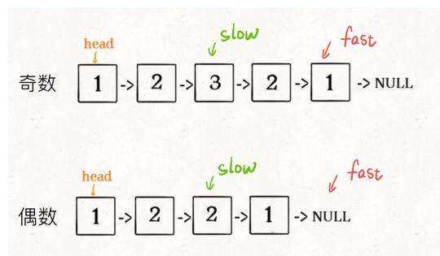

## 描述
请判断一个链表是否为回文链表。

## 示例
输入: 1->2
输出: false

## 思路
1. 先用快慢指针法找到链表的中点，还要判断奇偶，（如果是奇数，fast != null，slow还要往后移一位，）

2. 翻转slow到末尾
3. 开始比较

## 实现

```javascript
/**
 * Definition for singly-linked list.
 * function ListNode(val) {
 *     this.val = val;
 *     this.next = null;
 * }
 */
/**
 * @param {ListNode} head
 * @return {boolean}
 */
var isPalindrome = function(head) {
    // 快慢指针法找到中点
    let slow = fast = head;

    while(fast !== null && fast.next != null) {
        slow = slow.next;
        fast = fast.next.next;
    }
	
    if (fast !== null) {
        slow = slow.next;
    }
    // 翻转后半
    let right = reverse(slow);
    let left = head;

    // right 翻转后指向了null。用作判断条件
    while (right) {
        if (left.val !== right.val)
            return false;
        left = left.next;
        right = right.next;
    }
    return true;
};

var reverse = function(head) {
    let prev = null,
        next = null,
        curr = head;
    
    while (curr) {
        next = curr.next;
        curr.next = prev;
        prev = curr;
        curr = next;
    }
    return prev;
}
```